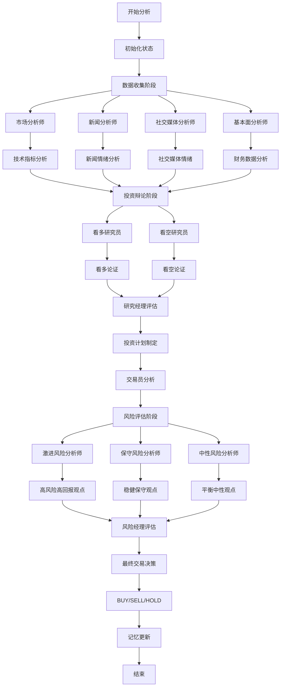

# TradingAgents 简化版 API 服务器文档

## 概述

`api_server_simple.py` 是 TradingAgents 项目的简化版 REST API 服务器，专门提供股票分析功能。该服务器基于 Flask 框架构建，集成了 TradingAgents 的核心分析引擎，并支持 MySQL 数据库存储分析结果。

## 主要特性

- 🚀 **简化设计**: 专注于股票分析功能，去除了复杂的多接口设计
- 📊 **智能分析**: 集成 TradingAgentsGraph 进行多维度股票分析
- 💾 **数据持久化**: 支持 MySQL 数据库存储分析消息和结果
- 🔧 **灵活配置**: 支持自定义 LLM 模型和分析参数
- 📝 **详细日志**: 完整的错误处理和日志记录
- 🌐 **跨域支持**: 内置 CORS 支持，便于前端集成

## 系统架构

```
┌─────────────────┐    ┌──────────────────┐    ┌─────────────────┐
│   前端应用      │───▶│  API 服务器      │───▶│ TradingAgents   │
│                 │    │ (Flask)          │    │ 分析引擎        │
└─────────────────┘    └──────────────────┘    └─────────────────┘
                              │
                              ▼
                       ┌──────────────────┐
                       │   MySQL 数据库   │
                       │ (分析结果存储)   │
                       └──────────────────┘
```

## 核心组件

### 1. TradingAgentsGraph 集成

TradingAgentsGraph 是一个基于 LangGraph 构建的多智能体股票分析框架，通过协调多个专业分析师和决策者来提供全面的投资建议。

#### 核心特性

- **多智能体协作**: 集成市场分析师、新闻分析师、基本面分析师、社交媒体分析师
- **辩论机制**: 看多/看空研究员进行投资辩论，风险管理团队进行风险评估
- **记忆系统**: 每个智能体都有独立的记忆系统，能够从历史决策中学习
- **工具集成**: 支持在线和离线数据源，包括 Yahoo Finance、Finnhub、AKShare 等
- **决策流程**: 从数据收集到最终交易决策的完整工作流

#### 输入输出

- **输入**: 股票代码 (symbol) 和分析日期 (date)
- **输出**:
  - 最终交易决策 (BUY/SELL/HOLD)
  - 详细的分析报告 (市场、新闻、基本面、情绪)
  - AI 交互消息记录
  - 辩论过程和决策推理

#### 配置参数

- **LLM 模型**: 支持 OpenAI、Anthropic、Google 等多种 LLM 提供商
- **辩论轮数**: 可配置看多/看空辩论和风险讨论的轮数
- **工具选择**: 可选择使用在线实时数据或离线缓存数据
- **分析师选择**: 可自定义参与分析的分析师类型

### 2. 数据库管理

- **DatabaseManager**: 处理 MySQL 连接和查询
- **MessageManager**: 管理分析消息的存储和检索
- **配置**: host=localhost, port=13306, database=trading_analysis

### 3. 参数处理系统

- **双模式支持**: 直接参数模式和任务数据库模式
- **参数验证**: 确保输入数据的完整性和正确性
- **格式化**: 将数据库任务数据转换为分析引擎所需格式

## API 接口详细说明

### 1. 股票分析接口

**POST** `/analyze`

执行股票分析，支持两种调用模式。

#### 请求参数

| 参数名          | 类型   | 必需       | 说明                           |
| --------------- | ------ | ---------- | ------------------------------ |
| symbol          | string | 条件必需\* | 股票代码 (如: "NVDA", "AAPL")  |
| date            | string | 条件必需\* | 分析日期 (格式: "YYYY-MM-DD")  |
| task_id         | string | 条件必需\* | 任务 ID (从数据库获取任务数据) |
| conversation_id | string | 可选       | 会话 ID (用于追踪分析会话)     |
| config          | object | 可选       | 自定义配置参数                 |

\*注: 必须提供 (symbol + date) 或 task_id 其中一种参数组合

#### 模式 1: 直接参数模式

```json
{
  "symbol": "NVDA",
  "date": "2025-01-15",
  "conversation_id": "analysis_001",
  "config": {
    "max_debate_rounds": 2,
    "online_tools": true
  }
}
```

#### 模式 2: 任务数据库模式

```json
{
  "task_id": "task_12345",
  "date": "2025-01-15",
  "conversation_id": "analysis_002"
}
```

#### 响应格式

**成功响应 (200)**:

```json
{
  "success": true,
  "symbol": "NVDA",
  "analysis_date": "2025-01-15",
  "conversation_id": "analysis_001",
  "task_id": "task_12345",
  "decision": "BUY/SELL/HOLD",
  "ai_messages": [
    {
      "type": "ai",
      "content": "分析消息内容...",
      "timestamp": "2025-01-15T10:30:00",
      "step_index": 0,
      "message_index": 0
    }
  ],
  "final_state": {
    "market_report": "市场分析报告...",
    "fundamentals_report": "基本面分析...",
    "sentiment_report": "情绪分析...",
    "news_report": "新闻分析..."
  },
  "task_data": {
    "ticker": "NVDA",
    "title": "NVDA股票分析任务",
    "description": "分析NVDA的投资机会",
    "status": "pending",
    "research_depth": "deep",
    "analysis_period": "1m"
  },
  "timestamp": "2025-01-15T10:30:00"
}
```

**错误响应 (400/404/500)**:

```json
{
  "success": false,
  "message": "错误描述",
  "error_type": "ValueError",
  "timestamp": "2025-01-15T10:30:00"
}
```

### 2. 健康检查接口

**GET** `/health`

检查服务器运行状态和数据库连接。

#### 响应格式

```json
{
  "server": "TradingAgents API",
  "status": "healthy",
  "timestamp": "2025-01-15T10:30:00",
  "version": "1.0.0",
  "database": "connected"
}
```

### 3. 根路径接口

**GET** `/`

获取 API 服务器基本信息和可用接口列表。

#### 响应格式

```json
{
  "message": "TradingAgents API Server",
  "health": "/health",
  "analyze": "/analyze",
  "timestamp": "2025-01-15T10:30:00"
}
```

## 配置说明

### 默认配置

```python
DEFAULT_API_CONFIG = {
    "llm_provider": "openai",                    # LLM 提供商
    "backend_url": "https://api.nuwaapi.com/v1", # API 后端地址
    "deep_think_llm": "o3-mini-high",           # 深度思考模型
    "quick_think_llm": "o3-mini-high",          # 快速思考模型
    "max_debate_rounds": 1,                      # 最大辩论轮数
    "online_tools": True,                        # 启用在线工具
    "reset_memory_collections": False,          # 重置内存集合
}
```

### 数据库配置

```python
DATABASE_CONFIG = {
    "host": "localhost",
    "port": 13306,
    "database": "trading_analysis",
    "user": "root",
    "password": "12345678"
}
```

### API 密钥配置

```python
API_KEYS = {
    "openai_api_key": "sk-yOXwTRVHIub4m6WjEWin68sqvdYypExLyBbChOc38SX4PnpW",
    "finnhub_api_key": "d1htbc1r01qhsrhc1180d1htbc1r01qhsrhc118g"
}
```

## TradingAgentsGraph 详细架构

### 智能体角色体系

TradingAgentsGraph 采用多层次的智能体架构，每个智能体都有特定的职责和专业领域：

#### 1. 数据分析师层 (Analysts)

##### 市场分析师 (Market Analyst)

- **职责**: 分析技术指标和市场趋势
- **工具**:
  - `get_YFin_data_online/offline`: 获取股票价格数据
  - `get_stockstats_indicators_report_online/offline`: 生成技术指标报告
- **分析内容**:
  - 移动平均线 (SMA, EMA)
  - MACD 指标
  - RSI 相对强弱指数
  - 布林带 (Bollinger Bands)
  - ATR 平均真实范围
  - 成交量加权移动平均线 (VWMA)
- **输出**: 详细的技术分析报告和趋势判断

##### 新闻分析师 (News Analyst)

- **职责**: 分析全球新闻和宏观经济趋势
- **工具**:
  - `get_global_news_openai`: 使用 AI 获取全球新闻
  - `get_google_news`: 获取 Google 新闻
  - `get_finnhub_news`: 获取 Finnhub 新闻数据
  - `get_reddit_news`: 获取 Reddit 新闻讨论
- **分析内容**:
  - 宏观经济新闻
  - 行业相关新闻
  - 政策变化影响
  - 市场情绪变化
- **输出**: 新闻分析报告和市场影响评估

##### 社交媒体分析师 (Social Media Analyst)

- **职责**: 分析社交媒体情绪和公司特定新闻
- **工具**:
  - `get_stock_news_openai`: 使用 AI 获取股票相关新闻
  - `get_reddit_stock_info`: 获取 Reddit 股票讨论
- **分析内容**:
  - 社交媒体情绪分析
  - 公司特定新闻
  - 公众舆论趋势
  - 投资者情绪指标
- **输出**: 情绪分析报告和社交媒体趋势

##### 基本面分析师 (Fundamentals Analyst)

- **职责**: 分析公司财务状况和基本面数据
- **工具**:
  - `get_fundamentals_openai`: 使用 AI 获取基本面分析
  - `get_finnhub_company_insider_sentiment`: 内部人士情绪
  - `get_finnhub_company_insider_transactions`: 内部人士交易
  - `get_simfin_balance_sheet`: 资产负债表
  - `get_simfin_cashflow`: 现金流量表
  - `get_simfin_income_stmt`: 损益表
- **分析内容**:
  - 财务报表分析
  - 公司基本信息
  - 内部人士交易情况
  - 财务健康状况
- **输出**: 基本面分析报告和财务评估

#### 2. 研究员层 (Researchers)

##### 看多研究员 (Bull Researcher)

- **职责**: 提出看多论点，寻找投资机会
- **特点**:
  - 强调公司优势和增长潜力
  - 分析正面因素和市场机会
  - 反驳看空观点
  - 基于历史记忆学习和改进
- **输入**: 所有分析师报告
- **输出**: 看多投资论证

##### 看空研究员 (Bear Researcher)

- **职责**: 提出看空论点，识别投资风险
- **特点**:
  - 突出风险因素和挑战
  - 分析负面指标和威胁
  - 反驳看多观点
  - 基于历史记忆学习和改进
- **输入**: 所有分析师报告
- **输出**: 看空风险警告

#### 3. 管理层 (Managers)

##### 研究经理 (Research Manager)

- **职责**: 主持看多/看空辩论，制定投资计划
- **功能**:
  - 评估双方论点的说服力
  - 基于辩论结果做出投资建议
  - 制定详细的投资策略
  - 从历史决策中学习
- **输出**: 投资计划和策略建议

##### 风险经理 (Risk Manager)

- **职责**: 主持风险辩论，制定最终交易决策
- **功能**:
  - 评估三种风险观点
  - 平衡收益与风险
  - 制定最终交易建议
  - 优化投资组合配置
- **输出**: 最终交易决策和风险评估

#### 4. 风险评估团队 (Risk Management Team)

##### 激进风险分析师 (Aggressive Risk Analyst)

- **职责**: 倡导高风险高回报策略
- **特点**:
  - 强调增长潜力和竞争优势
  - 支持大胆的投资策略
  - 挑战保守观点
  - 寻找突破性机会

##### 保守风险分析师 (Conservative Risk Analyst)

- **职责**: 强调风险控制和资产保护
- **特点**:
  - 优先考虑稳定性和安全性
  - 识别潜在威胁和下行风险
  - 反对过度冒险
  - 确保长期可持续性

##### 中性风险分析师 (Neutral Risk Analyst)

- **职责**: 提供平衡的风险评估
- **特点**:
  - 权衡收益与风险
  - 寻找中庸之道
  - 挑战极端观点
  - 提供客观分析

#### 5. 执行层 (Execution)

##### 交易员 (Trader)

- **职责**: 基于投资计划制定具体交易策略
- **功能**:
  - 分析投资计划的可行性
  - 制定具体的买入/卖出/持有建议
  - 考虑市场时机和执行策略
  - 从历史交易中学习
- **输出**: 具体的交易建议和执行计划

### 工具集成体系

#### 在线数据源工具

- **Yahoo Finance**: 实时股价和市场数据
- **AKShare**: 中国股市数据（替代 Yahoo Finance）
- **Finnhub**: 新闻、财务数据和内部人士信息
- **Google News**: 全球新闻搜索
- **OpenAI API**: AI 驱动的新闻和基本面分析
- **MCP (Model Context Protocol)**: 标准化的外部数据接口

#### 离线数据源工具

- **缓存的历史数据**: 预处理的股价和财务数据
- **Reddit 数据**: 社交媒体讨论和情绪
- **SimFin 数据**: 标准化的财务报表数据

#### 技术分析工具

- **StockStats**: 技术指标计算库
- **自定义指标**: 专门的交易信号生成器

### TradingAgentsGraph 决策流程



### 记忆系统架构

每个智能体都配备独立的记忆系统，用于存储和检索历史经验：

#### 记忆类型

- **Bull Memory**: 看多研究员的历史决策和结果
- **Bear Memory**: 看空研究员的历史决策和结果
- **Trader Memory**: 交易员的历史交易和表现
- **Investment Judge Memory**: 研究经理的历史判断
- **Risk Manager Memory**: 风险经理的历史决策

#### 记忆功能

- **经验存储**: 保存决策过程和结果
- **相似情况检索**: 基于当前市场情况检索相关历史经验
- **学习改进**: 从成功和失败中学习，避免重复错误
- **决策优化**: 基于历史表现调整决策策略

### 配置系统详解

#### LLM 配置选项

```python
# 支持的 LLM 提供商
LLM_PROVIDERS = {
    "openai": ["gpt-4o", "gpt-4o-mini", "o3-mini-high"],
    "anthropic": ["claude-3-sonnet", "claude-3-haiku"],
    "google": ["gemini-pro", "gemini-pro-vision"]
}

# 模型角色分配
MODEL_ROLES = {
    "deep_think_llm": "用于复杂分析和深度思考",
    "quick_think_llm": "用于快速响应和简单任务"
}
```

#### 辩论配置

```python
DEBATE_CONFIG = {
    "max_debate_rounds": 1,        # 看多/看空辩论轮数
    "max_risk_discuss_rounds": 1,  # 风险讨论轮数
    "max_recur_limit": 100         # 最大递归限制
}
```

#### 工具配置

```python
TOOL_CONFIG = {
    "online_tools": True,          # 启用在线数据源
    "reset_memory_collections": False,  # 重置记忆集合
    "selected_analysts": ["market", "social", "news", "fundamentals"]
}
```

## 核心功能模块

### 1. 参数格式化模块

**函数**: `format_task_parameters_for_analysis(task_data, provided_date)`

**功能**: 将数据库任务数据转换为 TradingAgentsGraph 所需的参数格式

**处理逻辑**:

- 提取股票代码 (ticker 字段)
- 处理分析日期 (优先使用用户提供的日期)
- 根据分析周期生成合适的日期
- 参数验证和错误处理

### 2. 数据验证模块

**函数**: `validate_task_data_for_analysis(task_data)`

**功能**: 验证任务数据的完整性和有效性

**验证项目**:

- 必需字段检查 (ticker, task_id)
- 股票代码格式验证
- 数据类型验证

### 3. 错误处理模块

**函数**: `handle_error(error, operation, **kwargs)`

**功能**: 统一的错误处理和日志记录

**特性**:

- 详细的错误信息记录
- 错误堆栈跟踪
- 结构化的错误响应
- 控制台和文件双重日志

## 数据流程

### 分析请求处理流程

```
1. 接收请求参数
   ├── 模式1: symbol + date
   └── 模式2: task_id

2. 参数处理和验证
   ├── 从数据库获取任务数据 (模式2)
   ├── 参数格式化
   └── 数据验证

3. 初始化分析引擎
   ├── 创建 TradingAgentsGraph 实例
   ├── 应用自定义配置
   └── 设置调试模式

4. 执行股票分析
   ├── 调用 propagate() 方法
   ├── 获取分析决策
   └── 提取 AI 交互消息

5. 结果处理和存储
   ├── 格式化响应数据
   ├── 保存消息到数据库
   └── 返回分析结果
```

### 消息存储流程

```
1. 提取 AI 消息
   ├── 从 trace 中获取 (调试模式)
   └── 从 curr_state 中获取 (标准模式)

2. 消息处理
   ├── 验证消息类型
   ├── 标准化格式
   └── 添加元数据

3. 数据库存储
   ├── 使用 MessageManager.save_message_optimized()
   ├── 绑定到 task_id
   └── 记录存储状态
```

## 使用示例

### 启动服务器

```bash
python api_server_simple.py
```

服务器将在 `http://localhost:5000` 启动。

### 执行股票分析

```bash
# 使用直接参数模式
curl -X POST http://localhost:5000/analyze \
  -H "Content-Type: application/json" \
  -d '{
    "symbol": "NVDA",
    "date": "2025-01-15",
    "conversation_id": "test_analysis",
    "config": {
      "max_debate_rounds": 1,
      "online_tools": true
    }
  }'

# 使用任务数据库模式
curl -X POST http://localhost:5000/analyze \
  -H "Content-Type: application/json" \
  -d '{
    "task_id": "task_12345",
    "conversation_id": "test_analysis"
  }'
```

### 检查服务器状态

```bash
curl http://localhost:5000/health
```

## TradingAgentsGraph 使用示例

### 完整分析流程示例

以下是一个完整的股票分析流程，展示了 TradingAgentsGraph 如何协调多个智能体进行决策：

#### 1. 初始化和配置

```python
from tradingagents.graph.trading_graph import TradingAgentsGraph
from tradingagents.default_config import DEFAULT_CONFIG

# 创建自定义配置
config = DEFAULT_CONFIG.copy()
config.update({
    "llm_provider": "openai",
    "backend_url": "https://api.nuwaapi.com/v1",
    "deep_think_llm": "o3-mini-high",
    "quick_think_llm": "o3-mini-high",
    "max_debate_rounds": 2,
    "max_risk_discuss_rounds": 2,
    "online_tools": True,
    "selected_analysts": ["market", "social", "news", "fundamentals"]
})

# 初始化 TradingAgentsGraph
ta = TradingAgentsGraph(
    selected_analysts=["market", "social", "news", "fundamentals"],
    debug=True,
    config=config
)
```

#### 2. 执行分析

```python
# 执行股票分析
symbol = "NVDA"
analysis_date = "2025-01-15"

print(f"开始分析 {symbol} 在 {analysis_date} 的投资机会...")

# 运行分析
final_state, decision = ta.propagate(symbol, analysis_date)

print(f"最终决策: {decision}")
```

#### 3. 分析结果解读

```python
# 获取各个分析师的报告
market_report = final_state.get("market_report", "")
news_report = final_state.get("news_report", "")
sentiment_report = final_state.get("sentiment_report", "")
fundamentals_report = final_state.get("fundamentals_report", "")

# 获取辩论过程
investment_debate = final_state.get("investment_debate_state", {})
risk_debate = final_state.get("risk_debate_state", {})

# 获取最终交易决策
final_decision = final_state.get("final_trade_decision", "")

print("=== 分析报告摘要 ===")
print(f"市场分析: {market_report[:200]}...")
print(f"新闻分析: {news_report[:200]}...")
print(f"情绪分析: {sentiment_report[:200]}...")
print(f"基本面分析: {fundamentals_report[:200]}...")
print(f"最终决策: {final_decision}")
```

### API 调用示例

#### 使用直接参数模式

```python
import requests
import json

# API 端点
url = "http://localhost:5000/analyze"

# 请求数据
data = {
    "symbol": "AAPL",
    "date": "2025-01-15",
    "conversation_id": "apple_analysis_001",
    "config": {
        "max_debate_rounds": 2,
        "online_tools": True,
        "deep_think_llm": "o3-mini-high"
    }
}

# 发送请求
response = requests.post(url, json=data)

if response.status_code == 200:
    result = response.json()
    print(f"分析成功: {result['decision']}")
    print(f"AI 消息数量: {len(result['ai_messages'])}")
else:
    print(f"分析失败: {response.json()}")
```

#### 使用任务数据库模式

```python
# 首先在数据库中创建任务
task_data = {
    "task_id": "task_001",
    "ticker": "TSLA",
    "title": "特斯拉股票分析",
    "description": "分析特斯拉的投资机会和风险",
    "research_depth": "deep",
    "analysis_period": "1m",
    "status": "pending"
}

# 使用任务ID进行分析
data = {
    "task_id": "task_001",
    "conversation_id": "tesla_analysis_001"
}

response = requests.post(url, json=data)
result = response.json()
```

### 自定义分析师配置

```python
# 只使用市场和新闻分析师
ta_custom = TradingAgentsGraph(
    selected_analysts=["market", "news"],
    debug=True,
    config=config
)

# 使用所有分析师
ta_full = TradingAgentsGraph(
    selected_analysts=["market", "social", "news", "fundamentals"],
    debug=True,
    config=config
)
```

### 批量分析示例

```python
def batch_analysis(symbols, date):
    """批量分析多个股票"""
    results = {}

    for symbol in symbols:
        try:
            print(f"分析 {symbol}...")
            final_state, decision = ta.propagate(symbol, date)
            results[symbol] = {
                "decision": decision,
                "success": True,
                "final_state": final_state
            }
        except Exception as e:
            results[symbol] = {
                "decision": None,
                "success": False,
                "error": str(e)
            }

    return results

# 批量分析科技股
tech_stocks = ["NVDA", "AAPL", "MSFT", "GOOGL", "TSLA"]
results = batch_analysis(tech_stocks, "2025-01-15")

for symbol, result in results.items():
    if result["success"]:
        print(f"{symbol}: {result['decision']}")
    else:
        print(f"{symbol}: 分析失败 - {result['error']}")
```

## 最佳实践和优化建议

### 1. 性能优化

#### 缓存策略

```python
# 启用数据缓存
config["cache_enabled"] = True
config["cache_ttl"] = 3600  # 缓存1小时

# 使用离线数据进行快速测试
config["online_tools"] = False
```

#### 并发处理

```python
import asyncio
from concurrent.futures import ThreadPoolExecutor

async def async_analysis(symbol, date):
    """异步分析函数"""
    loop = asyncio.get_event_loop()
    with ThreadPoolExecutor() as executor:
        future = loop.run_in_executor(
            executor, ta.propagate, symbol, date
        )
        return await future

# 并发分析多个股票
async def concurrent_analysis(symbols, date):
    tasks = [async_analysis(symbol, date) for symbol in symbols]
    results = await asyncio.gather(*tasks, return_exceptions=True)
    return dict(zip(symbols, results))
```

### 2. 错误处理和重试

```python
import time
from functools import wraps

def retry_on_failure(max_retries=3, delay=1):
    """重试装饰器"""
    def decorator(func):
        @wraps(func)
        def wrapper(*args, **kwargs):
            for attempt in range(max_retries):
                try:
                    return func(*args, **kwargs)
                except Exception as e:
                    if attempt == max_retries - 1:
                        raise e
                    print(f"尝试 {attempt + 1} 失败: {e}")
                    time.sleep(delay * (2 ** attempt))  # 指数退避
            return None
        return wrapper
    return decorator

@retry_on_failure(max_retries=3)
def robust_analysis(symbol, date):
    """带重试机制的分析函数"""
    return ta.propagate(symbol, date)
```

### 3. 监控和日志

```python
import logging
import time
from datetime import datetime

# 配置详细日志
logging.basicConfig(
    level=logging.INFO,
    format='%(asctime)s - %(name)s - %(levelname)s - %(message)s',
    handlers=[
        logging.FileHandler('trading_analysis.log'),
        logging.StreamHandler()
    ]
)

def monitored_analysis(symbol, date):
    """带监控的分析函数"""
    start_time = time.time()
    logger = logging.getLogger(__name__)

    logger.info(f"开始分析 {symbol} - {date}")

    try:
        final_state, decision = ta.propagate(symbol, date)

        # 记录性能指标
        duration = time.time() - start_time
        logger.info(f"分析完成: {symbol} - {decision} (耗时: {duration:.2f}s)")

        # 记录AI消息数量
        if hasattr(ta, 'trace') and ta.trace:
            message_count = sum(len(step.get('messages', [])) for step in ta.trace)
            logger.info(f"AI消息数量: {message_count}")

        return final_state, decision

    except Exception as e:
        duration = time.time() - start_time
        logger.error(f"分析失败: {symbol} - {e} (耗时: {duration:.2f}s)")
        raise
```

### 4. 内存管理

```python
def memory_efficient_analysis(symbol, date):
    """内存高效的分析函数"""
    # 重置记忆集合以释放内存
    config_temp = config.copy()
    config_temp["reset_memory_collections"] = True

    ta_temp = TradingAgentsGraph(
        selected_analysts=["market", "news"],  # 减少分析师数量
        debug=False,  # 关闭调试模式以节省内存
        config=config_temp
    )

    try:
        final_state, decision = ta_temp.propagate(symbol, date)
        return final_state, decision
    finally:
        # 清理临时对象
        del ta_temp
```

### 5. 结果验证和质量控制

```python
def validate_analysis_result(result):
    """验证分析结果的质量"""
    required_fields = ["decision", "final_state", "ai_messages"]

    for field in required_fields:
        if field not in result:
            raise ValueError(f"缺少必需字段: {field}")

    # 验证决策格式
    valid_decisions = ["BUY", "SELL", "HOLD"]
    if result["decision"] not in valid_decisions:
        raise ValueError(f"无效的决策: {result['decision']}")

    # 验证AI消息
    if len(result["ai_messages"]) == 0:
        raise ValueError("没有AI交互消息")

    return True

def quality_controlled_analysis(symbol, date):
    """带质量控制的分析函数"""
    final_state, decision = ta.propagate(symbol, date)

    result = {
        "decision": decision,
        "final_state": final_state,
        "ai_messages": getattr(ta, 'trace', [])
    }

    validate_analysis_result(result)
    return result
```

## 日志和监控

### 日志配置

- **文件日志**: `api_server.log` (UTF-8 编码)
- **控制台日志**: 实时输出到标准输出
- **日志级别**: INFO 及以上
- **日志格式**: 时间戳 - 模块名 - 级别 - 消息

### 监控指标

- 请求处理时间
- 数据库连接状态
- 分析成功/失败率
- AI 消息存储状态
- 错误类型统计

## 错误处理

### 常见错误类型

1. **参数错误 (400)**

   - 缺少必需参数
   - 参数格式不正确
   - 数据验证失败

2. **资源未找到 (404)**

   - 任务 ID 不存在
   - 数据库记录未找到

3. **服务器错误 (500)**
   - 数据库连接失败
   - TradingAgentsGraph 执行异常
   - 内部处理错误

### 错误响应格式

所有错误都返回统一的 JSON 格式：

```json
{
  "success": false,
  "message": "具体错误描述",
  "error_type": "错误类型名称",
  "timestamp": "错误发生时间"
}
```

## 性能优化建议

1. **数据库连接池**: 使用连接池管理数据库连接
2. **缓存机制**: 对频繁查询的数据进行缓存
3. **异步处理**: 对长时间运行的分析任务使用异步处理
4. **负载均衡**: 在高并发场景下使用负载均衡
5. **监控告警**: 设置性能监控和异常告警

## 安全考虑

1. **API 密钥管理**: 避免在代码中硬编码敏感信息
2. **输入验证**: 严格验证所有输入参数
3. **SQL 注入防护**: 使用参数化查询
4. **访问控制**: 实施适当的身份验证和授权
5. **日志安全**: 避免在日志中记录敏感信息

## 扩展性

该 API 服务器设计为可扩展的架构，支持：

- 添加新的分析接口
- 集成其他数据源
- 支持更多的 LLM 提供商
- 扩展数据库存储功能
- 集成消息队列系统

## 依赖项

### Python 包依赖

```
flask>=2.0.0
flask-cors>=3.0.0
mysql-connector-python>=8.0.0
langchain-openai
langgraph
tradingagents (本地包)
```

### 系统依赖

- Python 3.8+
- MySQL 8.0+
- 网络连接 (用于 LLM API 调用)

## 故障排除

### 常见问题

1. **数据库连接失败**

   - 检查 MySQL 服务是否运行
   - 验证数据库配置参数
   - 确认网络连接

2. **TradingAgentsGraph 初始化失败**

   - 检查 API 密钥配置
   - 验证网络连接
   - 查看详细错误日志

3. **分析执行超时**
   - 调整递归限制参数
   - 检查 LLM API 响应时间
   - 考虑使用更快的模型

### 调试技巧

1. 启用调试模式查看详细日志
2. 使用健康检查接口验证系统状态
3. 检查 `api_server.log` 文件获取详细错误信息
4. 使用 curl 或 Postman 测试 API 接口

---

_本文档基于 api_server_simple.py v1.0.0 编写，如有更新请及时同步文档内容。_
